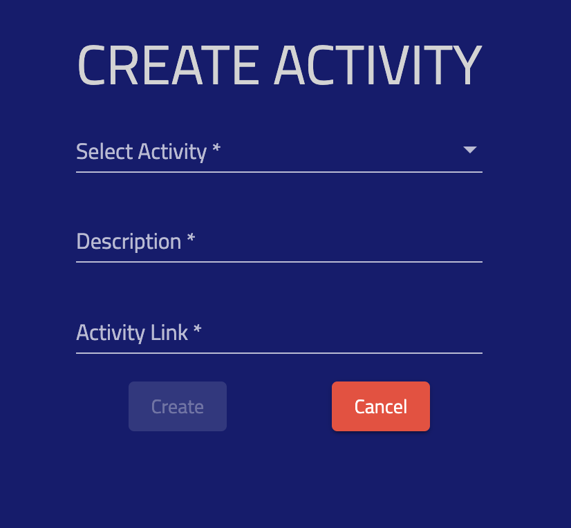

# Adding Activity

In order to play the Overwatch Challenge, you create activities that record what you're doing and learning.

In order to add an activity, select the dropdown and choose "Create Activity" and follow the dialog:

[click here to go back to the main site](https://overwatch-challenge.com/home)