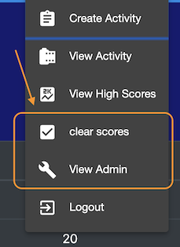
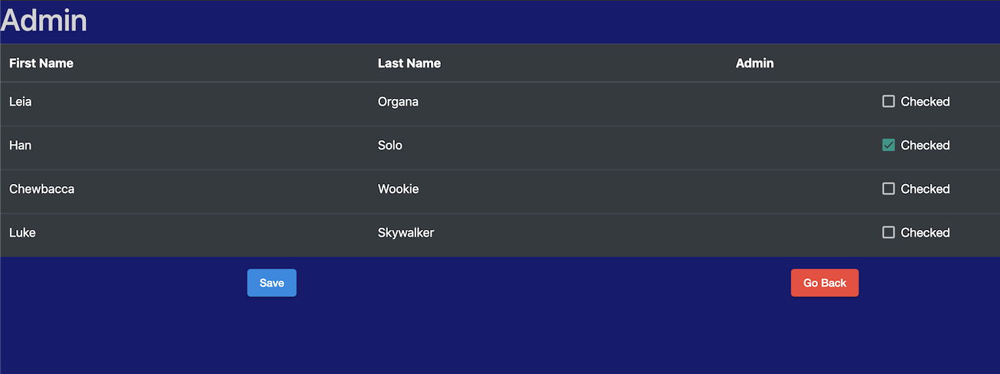

# Admin

Within the Overwatch Challenge there is a concept of being an __admin__.

This is just for controlling who can do specific functions like clearning the score.

Admins can clear the score and also make other users admins with the admin screen and clear score button.

When scores are "cleared" the top 3 scores are recorded in the "high score" page and then all users scores are made to be 0.

