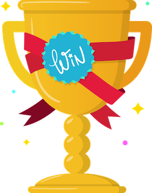

# Overwatch Challenge
This is the user guide for the Overwatch Challenge project.

The basic idea behind Overwatch Challenge was to make learning and sharing more fun.  The Overwatch Challenge project provides a basic game where players compete to gain points for learning activities.

Whenever you do a learning activity, just record it in the app and you'll get points.

Learning Activities could be anything.  Some examples include:
1. Listening to a technology podcast
2. Writing a blog post
3. Watching a YouTube video
4. Coding a starter project to learn a new framework
5. anything else...

The whole idea behind this is that we __learn__ and then __share__.  

How you do this is up to your team, but a convention would be to spend 15-30 mins on a Friday sharing what everybodys done for the week.  

The Overwatch Challenge system has __admin__, one of the admins will clear the scores and the high scores will be saved for the week.

The __activities recorded__ remain in the system, so we can all refer back to them in the future.

Check out some of the basic guides here on how to get started (its very intuitive as well).

Hope you enjoy the Overwatch Challenge!

