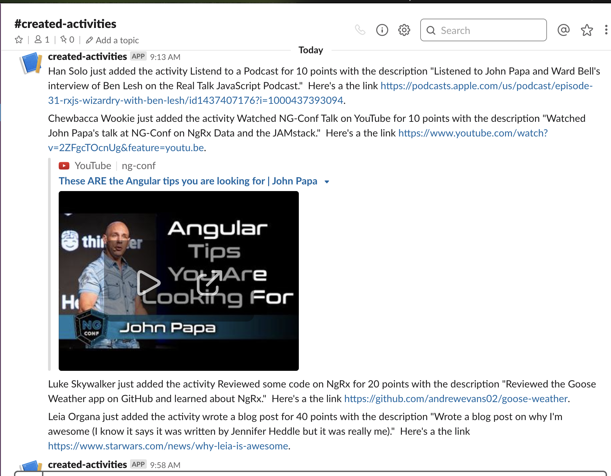
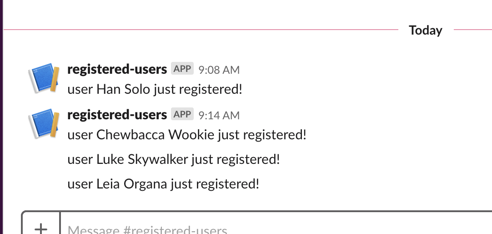

# Slack Integration

The Overwatch Challenge has slack integration for:

1. When activities are created

2. When users register with the app

This is all done with Google Firebase Cloud Functions.  Whenever records are added to the firestore NoSQL database, the cloud functions are triggered.

