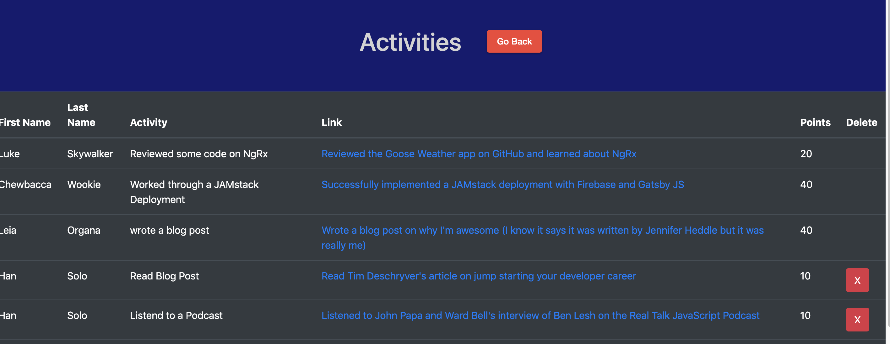

# Viewing Activity

Once activities have been added, they will appear in the view activity screen.

The table that is presented shows what the activity was and provides a link to access it online.  This is particuarly convenient when you consider links to podcasts and YouTube videos.

When a score is cleared ([scoring](scoring.md)), these activities remain listed here so that players can refer back to them later.

As a user, you can delete any activity you've created.  This is good in the case that you accidentally create somthing or misspell a name etc.

